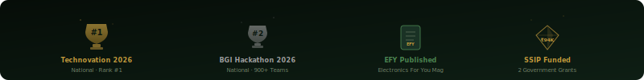

<div align="center">

<!--  -->

<!--  -->

<!-- <a href="https://princes-studio.netlify.app/">
  
</a> -->
<a href="https://princes-studio.netlify.app/">
  
</a>

<br/>

<!--  -->


<br/><br/>


<a href="mailto:princetagadiya11@gmail.com"></a>
<a href="https://linkedin.com/in/prince-tagadiya"></a>
<a href="https://princes-studio.netlify.app/"></a>
<a href="https://instagram.com/__.prince._.28"></a>

</div>

<br/>

<!--
============================================================
LIVE BUILD FEED — animated 3D terminal boot sequence
============================================================

<div align="center">

</div>

<br/>
-->


<!-- ============================================================ -->
<!-- 01 — FOUNDER'S SIGNAL                                        -->
<!-- ============================================================ -->

## ⚡ 01 · Founder's Signal

I'm a second-year ICT engineering student who'd rather solve a problem with transistors and logic gates than reach for whatever microcontroller a datasheet recommends. That instinct is what won a national hardware hackathon with a safety helmet that ships **zero lines of firmware** — every "smart" behavior in it happens in analog circuitry.

<!-- It's also the instinct behind **Creato4**. Rather than wait for a company to hire us before we could build something real, four of us started one ourselves — designing drones, embedded systems, and product hardware for people who need working prototypes, not just pitch decks. -->

```
┌─────────────────────────────────────────────────────────────────┐
│  MISSION                                                        │
│  Build things that physically work — drones, IoT sensors,       │
│  safety hardware, production PCBs — then wrap them in software   │
│  good enough that someone who isn't an engineer can use them.    │
└─────────────────────────────────────────────────────────────────┘
```

<div align="center">

</div>

<br/>


<!--
============================================================
02 — THE COLLECTIVE (Creato4 team)
============================================================

## 🧬 02 · The Collective — Meet Creato4

**The Creato4 Lab** is a four-engineer collective built on one bet: student engineers shouldn't need permission from a classroom to build things that work in the real world. We design, prototype, and ship — drones, embedded hardware, and the software that drives them — for anyone with a real problem to solve.

<div align="center">

</div>

<div align="center">

| | Engineer | Role | Focus |
|:---:|---|---|---|
| ⭐ | **Prince Tagadiya** <br/><sub>*(this profile)*</sub> | Founder & CEO · Embedded Systems Lead | System Design · Firmware · IoT |
| | **Rudra** | Software & AI Lead | Apps · Web · AI · Cloud |
| | **Nisarg** | Hardware Lead | PCB Design · Electronics |
| | **Khushi** | Mechanical Design Lead | CAD · Prototyping · DFM |

</div>

**What the lab builds:**

| Line | Capabilities |
|---|---|
| 🚁 **Drone Solutions** | Agriculture drones · FPV drones · Quadcopters · Hexacopters · Custom development |
| 🏭 **Smart Machines** | Vending machines · Automated packaging systems · Custom automation |
| 🔌 **Electronics** | Custom PCB design · Sensor integration · Circuit prototyping |
| 🧠 **Embedded Systems** | ESP32 · Raspberry Pi · Arduino · Firmware · Real-time control systems |
| 🛠️ **Product Engineering** | CAD & mechanical design · Enclosures · Design for manufacturing · 3D printing |

<div align="center">

**Have an idea? We're open for collaboration and product development.**
[→ Reach out via Portfolio](https://princes-studio.netlify.app/)

</div>

<br/>


-->

<!-- ============================================================ -->
<!-- 03 — MISSION CONTROL (personal impact stats — 3D cards)      -->
<!-- ============================================================ -->

## 📡 03 · Mission Control — Prince's Track Record

<div align="center">

</div>

<br/>

<div align="center">

</div>

<br/>


<!-- ============================================================ -->
<!-- 04 — BUILD LOG (chronological timeline)                      -->
<!-- ============================================================ -->

## 🛰️ 04 · Build Log

<details open>
<summary><b>Expand the full chronological build history</b></summary>
<br/>

```
2025
 │
 ├─ Jan → Apr   🚦 Density-Based Traffic Light Controller
 │              Solo build · Arduino + Ultrasonic Sensors
 │              📰 PUBLISHED in Electronics For You (EFY) Magazine
 │
 ├─ Mar → Jul   🌱 IoT Hydroponic Monitoring System
 │              ₹50,000 SSIP-funded · Real-time sensor dashboards
 │
 ├─ Jun → Aug   🎲 SMART Dice — Interactive Electronic Dice
 │              ESP8266 + OLED + motion sensing + mobile app
 │
 ├─ Jul → Sep   🎓 CampusFlow — AI Student Management MVP
 │              OCR PDF scanning · AI autofill · React + Firebase
 │
 ├─ Aug → Sep   💡 Smart Ambient TV Lighting System
 │              ESP32 + WLED + WS2812B, zero HDMI splitters
 │
 ├─ Sep → Nov   📡 Smart Universal Remote (IR + ESP-NOW)
 │
 ├─ Oct → Jan'26 ⛑️  Smart Safety Helmet — zero microcontrollers
 │              Pure logic-circuit design for electrical linemen
 │              🥇 WON Technovation Hackathon 2026 (Rank #1)
 │
 ├─ Oct → Dec   🏫 AI-Based Smart Classroom Monitoring
 │              ESP32 nodes + TinyML occupancy sensing
 │
 └─ Nov → Dec   🎯 Automatic IR Pointing Device
                Motorized directional IR transmission

2026
 │
 ├─ Jan → Feb   🔐 VaultOne — Secure Document Vault + AI Autofill
 ├─ Jan → Feb   🩺 MediClarify — AI Medical Document Simplifier
 ├─ Feb         🧑‍💼 DayFlow — HRMS (Odoo × GCET Hackathon)
 ├─ Feb → Mar   🧠 IntelliHire — AI Hiring Assessment Platform
 ├─ Mar → Now   🚁 AGRI-TITAN X6 — Smart Agriculture Drone
 │              <!-- ₹44,000 SSIP 2.0 funded · Creato4 flagship build -->
 │              ₹44,000 SSIP 2.0 funded
 │
 └─ May         💧 IoT Water Leakage & Theft Detection System
                🥈 RUNNER-UP · BGI Hackathon 2026 · 900+ participants
```

</details>

<br/>


<!-- ============================================================ -->
<!-- 05 — FEATURED DEPLOYMENTS (project cards)                    -->
<!-- ============================================================ -->

## 🛠️ 05 · Featured Deployments

<table width="100%">
<tr>
<td width="50%" valign="top">

### 🚁 AGRI-TITAN X6
<!-- **Team Leader · Creato4 Flagship** &nbsp;·&nbsp; `Mar 2026 – Present` -->
**Team Leader** &nbsp;·&nbsp; `Mar 2026 – Present`

A smart agriculture drone system controllable by farmers with **zero technical drone knowledge**, pairing embedded flight control with a simplified mobile app.

`Embedded Systems` `Drone Electronics` `Sensors` `Wireless Comms`

💰 ₹44,000 SSIP 2.0 funding secured

</td>
<td width="50%" valign="top">

### 💧 IoT Water Leakage & Theft Detection
**Team Leader** &nbsp;·&nbsp; `May 2026`

Real-time leakage and theft detection with a live analytics dashboard and offline cloud sync — engineered for scale, not just a demo.

`ESP32` `IoT Sensors` `Dashboards` `Cloud Sync`

🥈 Runner-up, BGI Hackathon 2026 (900+ participants)

</td>
</tr>
<tr>
<td width="50%" valign="top">

### ⛑️ Smart Safety Helmet
**Team Leader & Circuit Designer** &nbsp;·&nbsp; `Oct 2025 – Jan 2026`

A fully **microcontroller-free** safety helmet for electrical linemen — automatic beam control, fog detection, and emergency SOS, built entirely from analog logic circuits.

`Analog Electronics` `Logic Gates` `Transistor Switching`

🥇 1st Place, Technovation Hackathon 2026

</td>
<td width="50%" valign="top">

### 🚦 Density-Based Traffic Light Controller
**Solo Project** &nbsp;·&nbsp; `Jan 2025 – Apr 2025`

Ultrasonic-sensor-driven adaptive traffic signal timing, designed and built end-to-end.

`Arduino` `Ultrasonic Sensors` `Embedded C`

📰 Published in Electronics For You (EFY) Magazine

</td>
</tr>
<tr>
<td width="50%" valign="top">

### 🧠 IntelliHire
**Team Leader & Full-Stack Developer** &nbsp;·&nbsp; `Feb 2026 – Mar 2026`

AI-powered hiring platform running coding, MCQ, and subjective assessments with automated candidate ranking.

`React` `Firebase` `AI Integration` `Analytics`

</td>
<td width="50%" valign="top">

### 🌱 IoT Hydroponic System
**Team Leader & Dashboard Developer** &nbsp;·&nbsp; `Mar 2025 – Jul 2025`

SSIP-funded hydroponic farming rig with automated dashboards and live sensor visualization.

`IoT Sensors` `Data Visualization`

💰 ₹50,000 SSIP funding secured

</td>
</tr>
</table>

<div align="center">
<i>+ 7 more shipped builds — Smart Universal Remote, Automatic IR Pointing Device, VaultOne, MediClarify, DayFlow, Smart Ambient TV Lighting, SMART Dice.</i>
<br/>
<a href="https://princes-studio.netlify.app/"><b>→ Full project archive on my Portfolio</b></a>
</div>

<br/>


<!-- ============================================================ -->
<!-- 06 — SYSTEMS ARCHITECTURE (3D tech grid + skill bars)        -->
<!-- ============================================================ -->

## ⚙️ 06 · Systems Architecture

<div align="center">

</div>

<br/>

<div align="center">

</div>

<br/>

**Embedded Systems & Hardware**
<br/>
       

**Circuit Design & PCB Tools**
<br/>
    

**IoT & Wireless Systems**
<br/>
    

**Programming Languages**
<br/>
     

**AI & Full-Stack Development**
<br/>
      

**Design & Media**
<br/>
    

**Tools & Leadership**
<br/>
     

<br/>


<!-- ============================================================ -->
<!-- 07 — RECOGNITION WALL                                        -->
<!-- ============================================================ -->

## 🏅 07 · Recognition Wall

<table width="100%">
<tr>
<td width="33%" valign="top">

**🏆 Hackathons**
- 🥈 BGI Hackathon 2026 — National Runner-Up (900+ participants)
- 🥇 Technovation Hackathon 2026 — Rank #1
- 🎯 Vikas Saptah Hackathon 2025 — Only GCET finalist team
- 🧠 Codeversity National Hackathon (IIT Gandhinagar) — AI Domain
- 🏢 Odoo × GCET Hackathon 2026
- 🔐 Microsoft Imagine Cup 2026
- 🩺 Kaggle × Google DeepMind Challenge
- 📊 Data Hackathon 2026

</td>
<td width="33%" valign="top">

**📰 Publication**
- Electronics For You (EFY) — *Density-Based Traffic Light Controller*

**💰 SSIP Funding**
- AGRI-TITAN X6 — ₹44,000
- IoT Hydroponic System — ₹50,000

</td>
<td width="33%" valign="top">

**📜 Certifications**
- WordPress Website Development — Billi4You
- Java (Basic) — HackerRank
- Python (Basic) — HackerRank
- Fundamentals of Digital Marketing — Google Digital Garage
- HTML — Sololearn

</td>
</tr>
</table>

<br/>


<!-- ============================================================ -->
<!-- 08 — LIVE TELEMETRY (GitHub metrics)                         -->
<!-- ============================================================ -->

## 📊 08 · Live Telemetry

<div align="center">

<!-- GitHub Stats card — commented out (rate-limited / failing)

-->

<!-- Top Languages card — commented out

-->

<!-- Activity Graph — commented out

-->

<!-- Trophies — commented out

-->

<!-- Contribution Snake — commented out
<b>Contribution Signal</b><br/>

-->


</div>

<br/>

<!-- ============================================================ -->
<!-- FOOTER                                                        -->
<!-- ============================================================ -->

<div align="center">


### 📫 Let's Build Something Real

<a href="mailto:princetagadiya11@gmail.com"></a>
<a href="https://linkedin.com/in/prince-tagadiya"></a>
<a href="https://instagram.com/__.prince._.28"></a>
<a href="https://princes-studio.netlify.app/"></a>

<br/><br/>

<!-- 

<br/>
<sub>Prince Tagadiya · Founder & CEO, Creato4 · Built with hardware, hackathons, and one too many soldering irons.</sub> -->
<sub>Prince Tagadiya · Built with hardware, hackathons, and one too many soldering irons.</sub>

<br/><br/>


</div>
